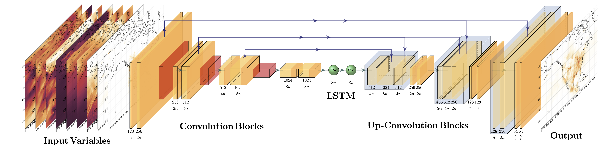

# unox

Use machine learning to make predictions of NOₓ and other atmospheric species.

This is an application of the U-net deep learning model for North American NOₓ emission estimates using the [`tensorflow`](https://www.tensorflow.org/) Python package.

<!-- In order for Sphinx to render the image on Read the Docs, the file path is assumed to have the `docs/` directory as root. However, for GitHub to render the image, the file path is assumed to have the project directory `unox/` as root. Therefore, you must duplicate the model diagram image in both places. -->


## Documentation

Setup guides, example usage, and API reference are available on [Read the Docs](https://unox.readthedocs.io/en/latest/index.html).

## Installation

This package is available for installation with `pip`. 
It is recommended to install `unox` in a virtual environment, such as one created with [`venv`](https://docs.python.org/3/library/venv.html) or [`conda`](https://docs.conda.io/en/latest/).
```bash
(venv_name) $ pip install unox
```

Currently, the version of Python required for `unox` depends on what you want to do. 
The analysis and plotting functionality is written for Python 3.9.21, while the GPU functionality to run the model is written for Python 3.12.4.
See the [installation](https://unox.readthedocs.io/en/latest/docs_setup/installation.html) guide for details and instructions on how to get set up developing the code.
<!-- See {doc}`installation`  -->

## Requirements

There are two different sets of requirements, one for the analysis / plotting environment and one for the GPU environment. 
For the analysis / plotting environment, dependencies are tracked using the [`poetry`](https://python-poetry.org/docs/) dependency manager and the current specified version dependencies are listed under `[tool.poetry.dependencies]` in the [`pyproject.toml`](https://github.com/scheemik/unox/blob/main/pyproject.toml) file. 
For the GPU environment, a summary of the requirements is given in the table below:

Package     | Version
---------   | -----------
Python      | 3.12.4
Xarray      | 2024.3.0
NetCDF4     | 1.7.2
TensorFlow  | 2.17.0
Keras       | 3.10.0
CUDA        | 12.6
<!-- cuDNN       | 8.3.0_11.4 -->

## Contributing

Interested in contributing? Check out the [contributing guidelines](https://unox.readthedocs.io/en/latest/contributing.html). Please note that this project is released with a [Code of Conduct](https://unox.readthedocs.io/en/latest/conduct.html). By contributing to this project, you agree to abide by its terms.

## License

The `unox` package was created by Mikhail Schee. It is licensed under the terms of the [MIT license](https://unox.readthedocs.io/en/latest/license.html).

## Credits

- The U-net model is based on [Tailong He's repository for Chinese NOₓ emissions](https://github.com/tailonghe/Unet_Chinese_NOx)[^1].
- Initial transition from China region to North America by Evelyn MacDonald.
- Initial adaptation to make estimates for CO by Daniel Sequeira.
- Documentation, converting `.npy` to `.nc` files, and ensemble runs by Mikhail Schee.
- The `unox` package was based off the `py-pkgs-cookiecutter` [template](https://github.com/py-pkgs/py-pkgs-cookiecutter) using [`cookiecutter`](https://cookiecutter.readthedocs.io/en/latest/).
- Package structure, documentation, and continuous integration based on the [Python Packages](https://py-pkgs.org/welcome) open source book by [Tomas Beuzen](https://www.tomasbeuzen.com/) & [Tiffany Timbers](http://tiffanytimbers.com/)

### Source of data

- Training stage 1 involves TCR-2 surface NO₂ concentrations and NOₓ emissions. Both could be found from [the JPL TCR-2 website](https://tes.jpl.nasa.gov/tes/chemical-reanalysis/products/monthly-mean). Last access was on 12 March 2025. 
- Training stage 2 involves *in situ* daily NO₂ measurements from the [United States Environmental Protection Agency (EPA)](https://aqs.epa.gov/aqsweb/airdata/download_files.html). Canadian data is planned to be added in the future. 
- Both stages require meteorological fields from ERA5 on [single levels](https://cds.climate.copernicus.eu/cdsapp#!/dataset/reanalysis-era5-single-levels?tab=overview) and on [pressure levels](https://cds.climate.copernicus.eu/cdsapp#!/dataset/reanalysis-era5-pressure-levels?tab=overview).
- Scripts for downloading ERA5 data and creating Unet input files and more information about the input file format are in the `datafiles/` directory. Data are currently stored on animus-c.

[^1]: He, T.-L.; Jones, D. B. A.; Miyazaki, K; Bowman, K. W.; Jiang, Z.; Chen, X; Li, R.; Zhang, Y; Li, K, (2022) "[Inverse modeling of Chinese NOₓ emissions using deep learning: Integrating in situ observations with a satellite-based chemical reanalysis](https://acp.copernicus.org/preprints/acp-2022-251/)", *Atmospheric Chemistry and Physics*, 22(21):14059-14074, <doi:10.5194/acp-22-14059-2022>